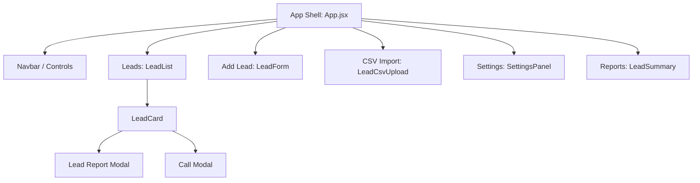

# ☀️ AI-Powered Solar Lead Caller — Frontend

The frontend is a React single-page app built with Vite and Chakra UI.
It focuses on lead intake, lead management, reporting, and AI-assisted calling workflows.

## Tech stack

### Core

- **React + Vite** — SPA UI and build tooling
- **Chakra UI** — design system, theming, layout primitives

### Integrations & utilities

- **Fetch API wrapper (`apiFetch`)** — centralized API base + cookie/session support
- **Cookie-based auth (HttpOnly)** — browser stores the session securely; JS never reads the auth token
- **CSRF protection** — a `csrf` cookie + `X-CSRF-Token` header for state-changing requests
- **Socket.IO client** — real-time updates (e.g. call transcripts)
- **Recharts** — charts for reporting/insights
- **PapaParse** — CSV streaming + batched upload for bulk lead import
- **html2pdf.js / html2canvas** — PDF export of lead reports

### Storage (browser)

- **localStorage** — UI preferences only (filters, toggles). No auth tokens.

## Architecture diagrams

### UI flow (modal-based navigation)



### Client ↔ Server (auth + CSRF + data)

```mermaid
sequenceDiagram
  participant U as User
  participant UI as React (client)
  participant API as Express API (server)

  U->>UI: Login
  UI->>API: POST /api/auth/login (JSON)
  API-->>UI: Set-Cookie auth=HttpOnly; Set-Cookie csrf=Readable

  U->>UI: Create / Update lead
  UI->>UI: Read csrf cookie
  UI->>API: POST/PUT /api/leads (X-CSRF-Token + cookies)
  API-->>UI: 200 OK (JSON)

  U->>UI: Load leads
  UI->>API: GET /api/leads (cookies)
  API-->>UI: 200 OK
```

### CSV import pipeline

```mermaid
flowchart LR
  A[User selects CSV] --> B[PapaParse step()]
  B --> C[Validate row]
  C --> D[Batch buffer (200)]
  D --> E[POST /api/leads/bulk]
  E --> F[Server inserts + de-dupes]
  F --> G[UI updates lead list]
```

## Project structure

Key files/folders:

- `src/App.jsx` — main shell (modal-based views, routing-less navigation)
- `src/components/LeadList.jsx` — lead list (filters, grouping)
- `src/components/LeadCard.jsx` — lead card + report modal + call modal
- `src/components/LeadForm.jsx` — add a lead
- `src/components/LeadCsvUpload.jsx` — bulk import
- `src/components/LeadSummary.jsx` — reports/insights summary
- `src/components/SettingsPanel.jsx` — UI preferences
- `src/services/apiClient.js` — `apiFetch` wrapper (cookies + CSRF)
- `src/theme/index.js` — Chakra theme tokens

> Note: This project intentionally uses modal-based navigation instead of React Router.

## How to run the frontend

### 1) Install dependencies

```bash
cd client
npm install
```

### 2) Start dev server

```bash
cd client
npm run dev
```

### 3) Backend required

The UI expects the backend API to be available.
In local development, Vite proxies `/api/*` to the server (default: `http://127.0.0.1:3000`).

Common endpoints:

- `GET /api/leads` — load leads
- `POST /api/leads` — add a lead
- `PUT /api/leads/:id` — update lead
- `POST /api/leads/bulk` — bulk insert

## CSV upload format

The first row must contain these headers:

```text
firstName,lastName,phone,street,city,state,zip,note
```

## Author

Nick Santiago — Solar Consultant | AI Sales Innovator | Full-stack Dev